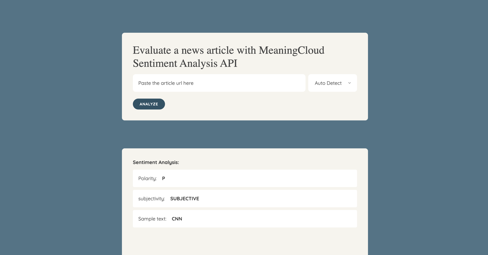

# Project Instructions

The goal of this project is to give you practice with:
- Setting up Webpack
- Sass styles
- Webpack Loaders and Plugins
- Creating layouts and page design
- Service workers
- Using APIs and creating requests to external urls

In addition to the listed goals above, this project also utilizes a [Natural Language Processing API by MeaningCloud](https://learn.meaningcloud.com/developer/sentiment-analysis/2.1/doc). Learn more with the link below. We will use this API to determine various attributes of an article or blog post.



## Getting started

Once you download the project, `cd` into the project folder and run:
```
npm i --legacy-peer-deps
```

## Build webpack bundle for both development and production mode

Once the dependencies are installed, run the following command to build the webpack bundles:
```
npm run build-prod
```

```
npm run build-dev
```

## Start the server

Once the bundles are built, run the following command to start the server:
```
npm start
```

## Use the NLP API

One the server starts and the home page loads, the site is ready to be used!

To start, paste the url of your favourite news article in the input field and the website will work the magic for you. MeaningCloud's sentimental analysis will produce values for many parameters. Here we are only showcasing 3 ofthem:

- **Overall polarity: polarity of all the text combned on the page. Possible values are:**
- P+: strong positive
- P: positive
- NEU: neutral
- N: negative
- N+: strong negative
- NONE: without polarity

- **Subjectivity: marks the subjectivity of the text. It has two possible values:**
- OBJECTIVE: the text does not have any subjectivity marks.
- SUBJECTIVE: the text has subjective marks.

- **Sample text: a text snippet from the article.**

## Run Jest Test

Run the following command to run the Jest tests

```
npm run test
```

## Dependencies

- "dotenv": "^8.2.0",
- "express": "^4.17.1",
- "jest-fetch-mock": "^3.0.3",
- "webpack": "^4.46.0",
- "webpack-cli": "^3.3.12"

## Dev Dependencies
- "@babel/core": "^7.13.15",
- "@babel/plugin-transform-modules-commonjs": "^7.13.8",
- "@babel/preset-env": "^7.13.15",
- "babel-loader": "^8.2.2",
- "body-parser": "^1.19.0",
- "clean-webpack-plugin": "^3.0.0",
- "cors": "^2.8.5",
- "css-loader": "^5.2.1",
- "html-webpack-plugin": "^3.2.0",
- "jest": "^26.6.3",
- "mini-css-extract-plugin": "^1.4.1",
- "node-fetch": "^2.6.1",
- "node-sass": "^6.0.0",
- "optimize-css-assets-webpack-plugin": "^5.0.4",
- "sass": "^1.32.8",
- "sass-loader": "^10.1.1",
- "style-loader": "^2.0.0",
- "terser-webpack-plugin": "^5.1.1",
- "webpack-dev-server": "^3.11.2",
- "workbox-webpack-plugin": "^6.1.5",
- "validator": "^13.7.0"
